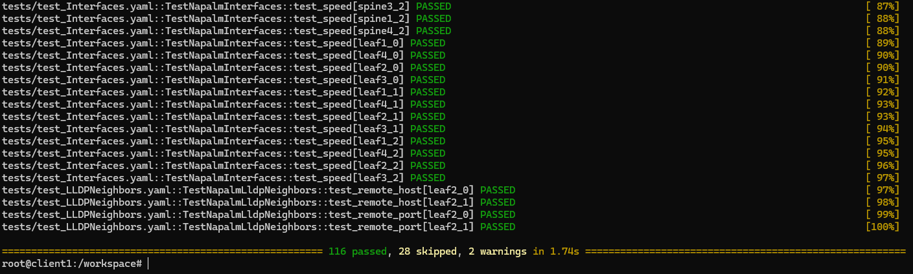
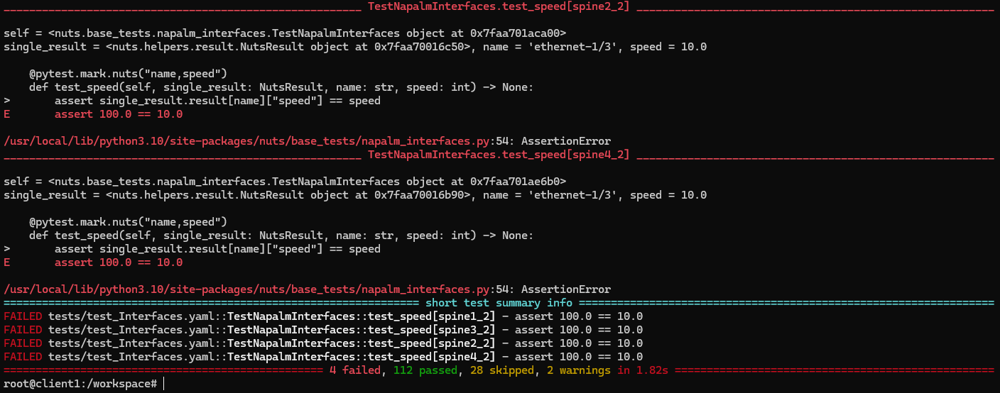

# nuts-containerlab-demo




## Requirements

 - [containerlab](https://containerlab.dev/)
 - [gnmic](https://gnmic.openconfig.net/)

## Lab

The lab is heavily based on the 5-stage Clos fabric from ContainerLab (https://containerlab.dev/lab-examples/min-5clos/).

The client1 is replaced with a Python container image and NUTS will be installed on it. 

The router images are Nokia SR Linux. To be able to use NAPALM, the community driver (https://github.com/napalm-automation-community/napalm-srlinux) is used.

### Nuts installation

The installation for NUTS can be found in ./configs/client1.sh

## Start

```bash
sudo containerlab deploy -t setup.clos02.clab.yml
chmod +x ./setup.sh
./setup.sh
```

Connect to client1 and run network tests:

```bash
docker exec -it clab-clos02-client1 bash

root@client1:/# cd /workspace/
root@client1:/workspace# ls -l
total 12
drwxr-xr-x 2 1000 1000 4096 Aug  8 22:10 inventory
-rw-r--r-- 1 1000 1000  225 Aug  8 20:55 nr-config.yaml
drwxr-xr-x 2 1000 1000 4096 Aug  9 08:12 tests

root@client1:/workspace# pytest -vv
```

## Stop

```bash
sudo containerlab destroy
```


## Running Tests

In the best case, all tests will be successful (passed) or skipped. When the setup is executed, no test should fail.


When we change tests we can see that tests fail now:

```diff
diff --git a/nuts_data/tests/test_Interfaces.yaml b/nuts_data/tests/test_Interfaces.yaml
index 18fbab6..b727930 100644
--- a/nuts_data/tests/test_Interfaces.yaml
+++ b/nuts_data/tests/test_Interfaces.yaml
@@ -22,7 +22,7 @@
       is_enabled: true
       is_up: true
       mtu: 9232
-      speed: 100.0
+      speed: 10.0

     # Test interface speed
     - tags:   # Also group spine could be used.
```

